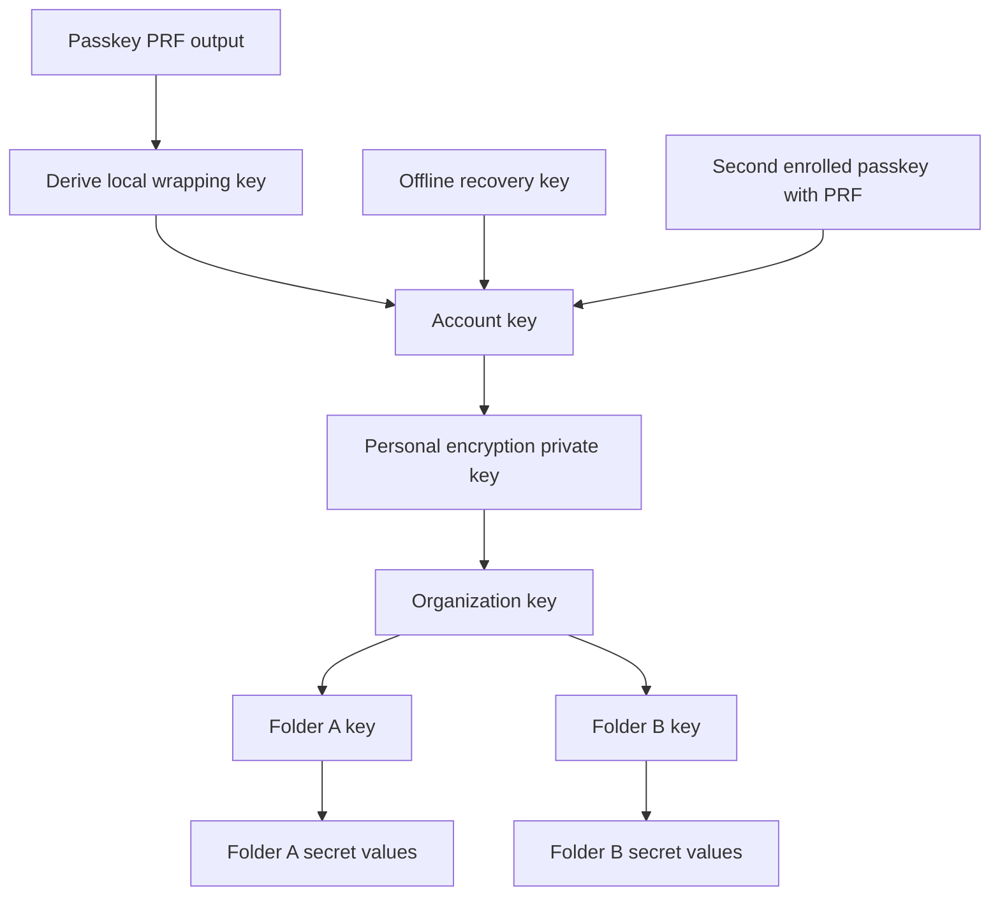
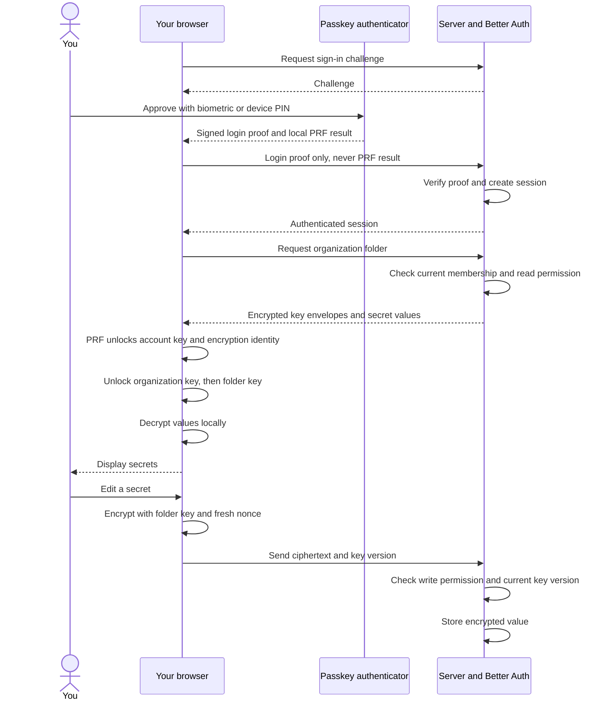
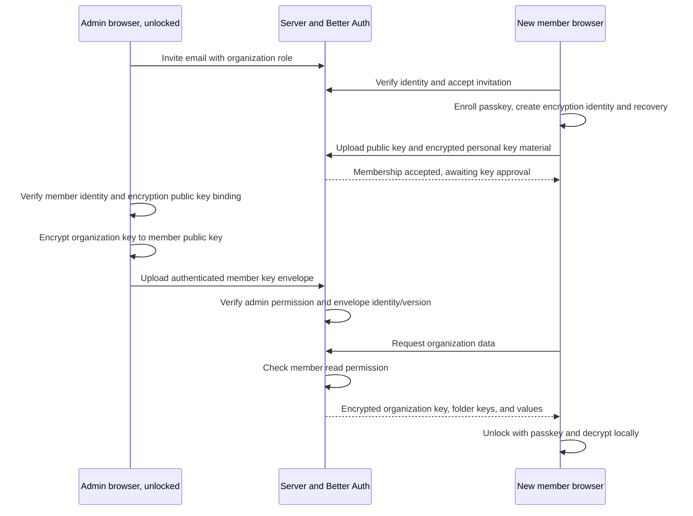
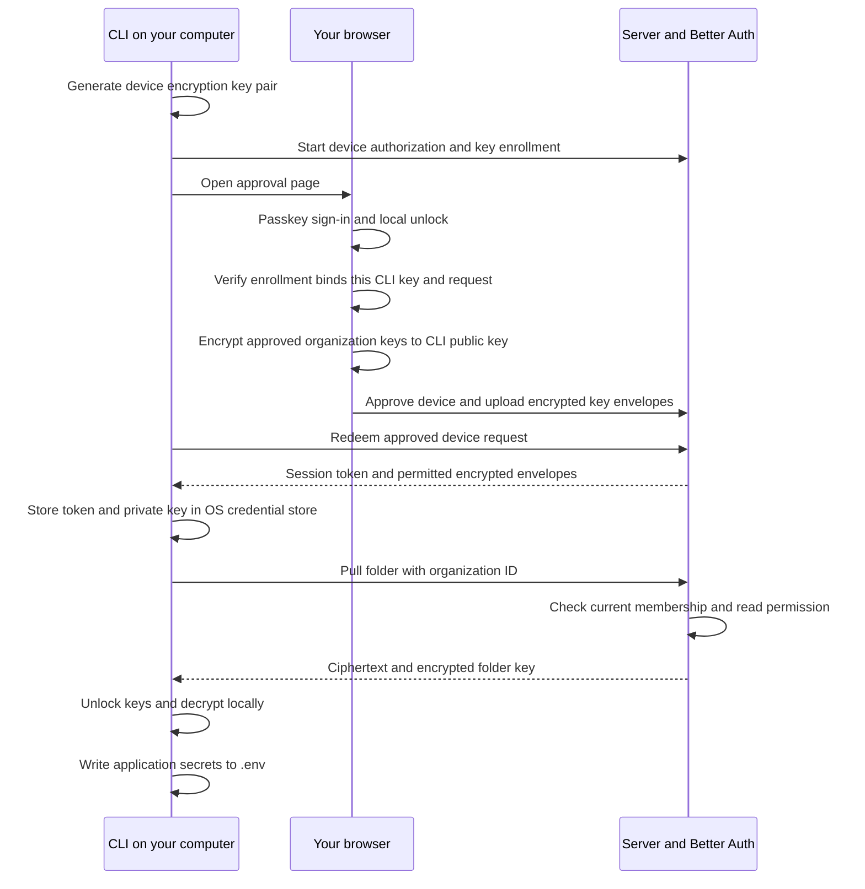

# Passwordless end-to-end flow

These diagrams describe the implemented organization/key hierarchy. See `web/README.md` for deployment requirements, verification, and the limits of virtual-authenticator testing. Better Auth verifies identity and membership; the application enforces secret permissions; authorized clients perform all secret encryption and decryption.

## First setup and the key hierarchy

After verified onboarding, the browser registers a passkey and generates a random account key and a separate encryption identity. Creating an organization generates its organization key; creating each folder generates a folder key. Public identity keys and encrypted key envelopes are uploaded. The user saves an offline recovery key and can enroll a second passkey, each protecting another copy of the same account key.

An envelope is an encrypted copy of a key. The arrows below mean “unlocks an encrypted copy,” not “derive every key from one credential.” All underlying data keys are random.

Passkeys for signing in and personal encryption identities are separate key pairs. The passkey's private signing key stays in its authenticator. PRF output, decrypted encryption keys, and secret plaintext stay on clients. The server knows organization membership, public keys, folder/secret names, and encrypted records.

## Sign in, read, and save

An authenticated session and an unlocked client are separate states. Existing sessions may still need a local passkey unlock after reload or lock. Lock/logout clears decrypted key material from browser memory. PRF support must be proven on the supported browser/authenticator combinations before using production secrets.

## Invite a member

The server can deliver an already encrypted envelope; it cannot create a usable envelope for a new member on its own. Admin key verification needs an authenticated enrollment mechanism and an explicit verification method; merely trusting an arbitrary public key returned by the server is insufficient.

## Enroll and use the CLI

Push reverses the data path: encrypt on the CLI, check write permission on the server, store ciphertext. Project configuration contains only server/organization/folder identifiers. `.env` contains exported application secrets, with no vault password. Enrollment key binding and key delivery are application features added alongside the existing Better Auth device flow, not capabilities supplied by that flow alone.

## Recovery and removal

- Lost passkey: authenticate through the controlled recovery flow, then unlock with the offline encryption recovery key or a second enrolled PRF-capable passkey and enroll a replacement. An unlocked owner/admin can instead provision organization access to a verified replacement encryption identity. Email alone cannot decrypt encrypted secrets.
- Removed member/device: block subsequent API and envelope access immediately. An authorized unlocked client rotates organization and affected folder keys and provisions the remaining identities. Reject old-key writes; resume new writes after the new epoch is activated.
- Previously downloaded plaintext remains accessible to its holder. Rotate downstream credentials where required. Losing all usable decrypting identities and backups permanently loses access to the data.

E2EE protects stored values from server-side decryption. It does not hide metadata or protect against a compromised browser, CLI, or malicious application code delivered by the web origin.
